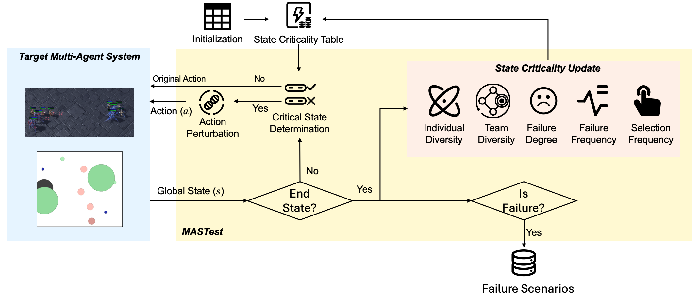

**Note: This is a fork of the original repository**

We integrate the DisQ heuristic (Disagreeing Q-values) to focus on test cases, where there is a disagreement in exzpected rewards among the cooperating agents.

[Here is the original repository](https://github.com/issta24/ISSTA24_MAT)


# <font size=6>MAT</font>
This repository contains data and code for the paper Behavioral Diversity Guided Testing for Multi-Agent Systems

# Overview

We propose a testing method called MAT for MAS that can improve the diversity of generated failure scenarios by incorporating guidance on behavioral diversity. 

We make experimental evaluation of effectiveness of MAT on two environments (Coop Navi and StarCraft II) with promising performance, outperforming the SOTA baseline.

The overall structure is shown in the figure below:


# Environment Setup
## Installation instructions

Install Python packages for Coop Navi and StarCraft II 

```shell
# For Coop Navi
conda create -n MAS_Coo python=3.6.5
conda activate MAS_Coo

pip install torch == 1.1.0
git clone https://github.com/openai/multiagent-particle-envs.git
cd multiagent-particle-envs
pip install -e .

```

```shell
# For StarCraft II
conda create -n MAS_Com python=3.8
conda activate MAS_Com

bash install_dependecies.sh
bash install_sc2.sh
```


## Command Line Tool

**Run an experiment**

```shell
# For Coop Navi
$ python main.py --scenario-name=simple_adv --evaluate-episodes=10
```

```shell
# For StarCraft II
$ python3 src/main.py --config=qmix --env-config=sc2 with env_args.map_name=1c3s5z
```


# Trend Graph Results
The trends of \%Coverage, #Distance, #Failure on cooperative task and competitive task.


# Reference
- https://github.com/oxwhirl/smac
- https://github.com/hijkzzz/pymarl2/
- https://github.com/NeteaseFuxiRL/wuji
- https://github.com/openai/multiagent-particle-envs
- https://github.com/openai/maddpg
