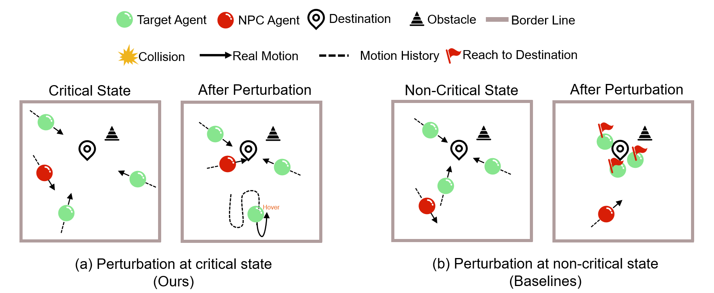

# Qualitative Analysis
We further improve the qualitative analysis of the results combined with the principles of methods. Specifically, we analyze why our approach can generate some failure scenarios and the baseline method does not. 

Details are shown below to analyze the results:

As shown in Figure (a), our method recognizes the current state as the critical state, i.e., the target agent is moving towards the destination, and the NPC is at a suitable distance from the topmost target agent. The NPC is perturbed so that it runs perpendicular to the target agent and collides with it.

In the contrast, baselines select a non-critical state for perturbation, as shown in Figure (b). Because the critical opportunity is missed, after the perturbation, the NPC cannot interfere with the target agent in time, and finally the target agent can reach the destination.

As shown in Figure (a), the critical state is: the target agent moves towards the destination, and NPC is at its tail and close to it. Our method recognizes this critical state and causes the NPC to start chasing, creating a failure scenario.

In contrast, the baseline selects non-critical states for perturbation, as shown in Figure (b). Due to ignoring critical state, after the perturbation, the NPC has been unable to catch up with the target agent, so there is no failure scenario.

